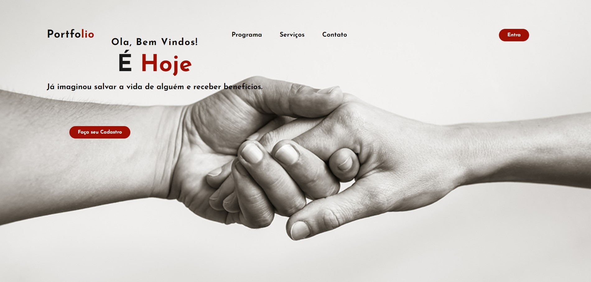

[](#)

Seja bem-vindo à Documentação Técnica do projeto É Hoje! Aqui você terá acesso a informações detalhadas sobre o projeto, as tecnologias empregadas e a arquitetura utilizada.

## Visão Geral do Projeto

### Como surgiu o É Hoje?

O É Hoje surgiu mediante a necessidade que os bancos de sangues tem em manter seu estoque precisando está sempre lançando campanhas para icentivar pessoas a doarem sangue e ajudar pessoas que precisam.
Com uma ação lançada pela cantora Ludmilla onde as pessoas comparecerem em um número expressivo de pessoas para ganhar um ingresso para o seu show apresentou uma ideia para ajudar quem precisa e conectar pessoas que buscam benefícios.

## Tecnologias Utilizadas

| Tecnologia | Função na aplicação                                                                                                                                  |
| ---------- | ---------------------------------------------------------------------------------------------------------------------------------------------------- |
| JavaScript | Linguagem de programação utilizada para escrever o código do back-end da aplicação.                                                                  |
| Html 5     | Extruturação de texto utilizada para apresentação da página landing page.                                                                            |
| CSS 3    | Ferramenta que monitora alterações nos arquivos do projeto e reinicia automaticamente o servidor durante o desenvolvimento.                            |
| Mongoose   | Biblioteca do Node.js que simplifica a interação com o MongoDB, um banco de dados NoSQL orientado a documentos.                                      |
| Express    | Framework web para Node.js que simplifica o desenvolvimento de aplicativos e APIs RESTful.                                                           |
| Chalk      | Pacote npm para formatação de texto no console, utilizado para melhorar a legibilidade dos logs e mensagens de saída no ambiente de desenvolvimento. |
| MongoDB    | Banco de dados NoSQL orientado a documentos, usado para armazenar os dados do projeto.                                                               |
| Postman    | Plataforma de testes de API, utilizada para testar e documentar as requisições e respostas do projeto.                                               |


## 📁 Arquitetura do Projeto

```
 📁mvc
   |
   |--📁 biblioteca
   |  |
   |   --|- 📄 arquivo.js
   |     |- 📄 tempCodeRunnerFile.js
   |
   |--📁node_modules
   |
   |--📁 src
   |  |
   |  |--📁 controllers
   |  |    |- 📄 projetoControllers.js  |
   |  |
   |  |--📁 database
   |  |    |- 📄 dbConect.js
   |  |
   |  |--📁 models
   |  |    |- 📄 eHoje.json
   |  |    |- 📄 peojetos.js
   |  |
   |  |--📁 routes
   |  |    |- 📄 index.js
   |  |    |- 📄 projeto.js
   |  |
   |  |-📄 app.js
   |  |
   |- 📄 .gitignore
   |- 📄 package-lock.json
   |- 📄 package.json
   |- 📄 README.md
   |- 📄 server.js


```

## Arquitetura MVC

O projeto segue a arquitetura Model-View-Controller (MVC), que divide a aplicação em três componentes principais:

1. **Model:** Responsável pela definição da estrutura de dados e regras de negócio.
2. **View:** Responsável pela interface de usuário e apresentação dos dados ao usuário final.
3. **Controller:** Responsável por receber as requisições do usuário, interagir com o Model e renderizar a View correspondente.

A utilização do padrão MVC permite uma separação clara de responsabilidades, facilitando a manutenção, reutilização de código e testabilidade do projeto.

## :memo: Esquema da API usando Mongoose (MongoDB)

```
    {
        nome : {type: String, required: true},
        dataNascimento: {type: String, required: true},
        cpf: {type: String, required: true},
        sexo: {type: String, required: true},
        peso: {type: String, required: true},
        tipoSanguineo: {type: String, required: true},
        telefone: {type: Array, required: true},
        email: {type: String, required: true},
        endereco: {type: Object, required: true},
        tatto: {type: Boolean, required: true},        
        tempotatto: {type: String},        
        permissaoNotificacao: {type: Boolean, required: true},        
        indicaAmigos: {type: Boolean}

    }
```
## :rocket: Testando Rotas

 <h3> Métodos e rotas Utilizados:</h3>

| Verbo  | EndPoint  | Descrição do Rota                                 |
| ------ | --------- | ------------------------------------------------- |
| GET    | /doadores | Listar todos as Usuários cadastrados              |
| GET    | /:id      | Mostra o cadastro do Usuário por ID               |
| POST   | /doadores | Registra um novo Usuário                          |
| PUT    | /:id      | Altera dados do Usuário identificado pelo id      |
| DELETE | /:id      | Remove o cadastro do Usuário identificado pelo id |

## Testando a API

Para testar as API do projeto, você pode utilizar o Postman. Siga as etapas abaixo:

1. Abra o Postman.
2. Importe a coleção de requisições do projeto, localizada no diretório `postman` do repositório.
3. Após importar a coleção, você poderá enviar as requisições para testar as funcionalidades disponíveis.

